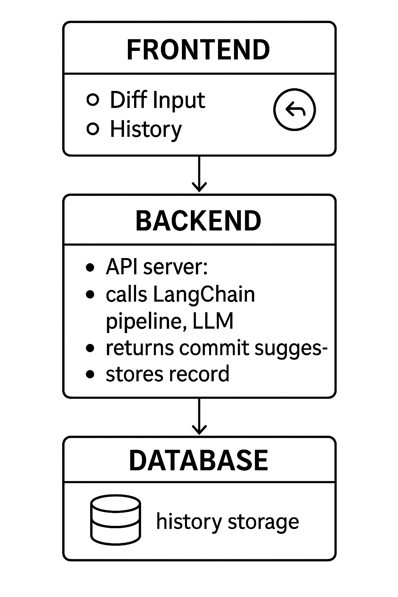

# AI Commit Message helper

This application is meant to help developers write commit messages using AI. This is a web application that receices a git diff pasted by the user and responds with a suggested git commit message generated by open AI's api platform. This application also has a history of past commit messages and allows users to delete them.

## Development Process

When I started this application I decided the following stack was appropriate:

- Typescript
- React (TSX)
- Express.js + REST
- LangChain
- LLM API of choice
- RDBMS (Sqlite) + ORM (Prisma)
- Docker

Most of these I had already used in the past to some capacity but it was definitely a first with Langchain and Prisma. While implementing this application I set myself to build the following simple architecture:



Before I started, I decided which features where most prioritized which looked like this:

1. High priority

- Input (git diff input with instructions) ✅
- Output (commit message suggestion) ✅
- Cleanup after suggestion generated ✅

2. Medium Priority

- Cosmetics of webapp ✅
- Loading Screen ❌

3. Low prio

- Split screen (for displaying git diff) ❌
- History (for displaying past commits) ✅
- Containerization ✅

I decided several things along the way to simplify my learning experience of the things I wasn't so sure about while still attempting to achieve the core functionality. Here was a detail of what those decisions looked like:

1. When looking at the design of the application I decided to simplify the interaction with it. This meant that per diff only a single commit suggestion would be given. This meanth that no further suggestions or commentary is permitted after the suggestion is given. **Certainly something to be improved.**
2. I used an ai chatbot to generate the initial mockup of my ui then replicated it using react.
3. I would use vite to create my frontend application.
4. I tried using an express code generator, but the boilerplate was too much so I kept it simple.
5. I decided on using sqlite as I was going to need the spare time to look into prisma. I choose both of these over the more common postgresql and knex. This seemed more simple and easy to implement given the time frame.
6. I intentionally left history and containers last as those implementations required some looking into.

## Running the Application

To run this application some environment variables will be necessary in the backend application. These should be added to a `.env` file.

```shell
#.env
OPENAI_API_KEY=<open-api-key>
DATABASE_URL="<reference-to-sqlite-db>"
```

To run the application:

```shell
docker-compose up
```

The application should be up and running at `localhost:5173` in a Google Chrome browser.
